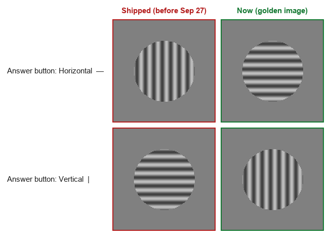
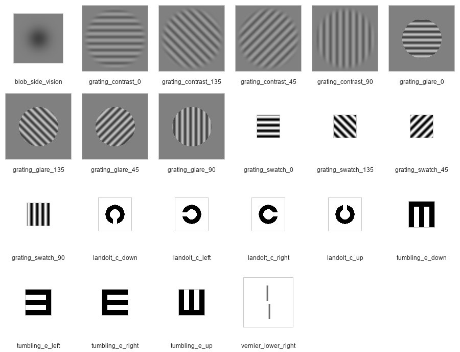

# EyeVio — Application Capabilities

_Last updated: September 28, 2026. Compiled from the current source code (frontend `eyevio-frontend/`, backend `eyevio/`). Includes the Phase 1 test-method review (Section 4.1), the Phase 2 method work (Section 4.2), the model and analytics review (Section 6.1), what is still open (Section 17) and the efficiency and testing work (Section 18)._

---

## 1. What EyeVio is

EyeVio is a browser-based eye-health **tracking and home-screening** platform. People take interactive vision tests, capture eye photos with their camera, log daily habits, and follow their trends over time. The app flags meaningful changes, sends alerts, and produces a one-page summary that can be shown to an eye doctor.

**Tagline:** Track. Predict. Protect your vision.

**Regulatory positioning.** EyeVio is framed as **wellness / educational software, not a medical device** (FDA SaMD-aware framing in `utils/samd.js` and the `SamdDisclaimer` component). Every test and photo result is labelled "screening only — not a diagnosis", and results point users to a professional eye exam instead of making clinical claims.

**Who it is for**
- Adults who want to monitor their eyes between exams (screen workers, glasses/contact-lens wearers, older adults).
- Parents tracking children's myopia and screen/outdoor habits.
- Caregivers overseeing a family member's eye-health routine.

---

## 2. Architecture at a glance

| Layer | Technology |
|---|---|
| Frontend | React 18, Vite, Tailwind CSS, Zustand (state), React Router, Framer Motion, Recharts, react-hook-form + Zod |
| In-browser computer vision | MediaPipe Face Mesh and Hands, react-webcam, Web Speech API (voice answers). face-api.js and WebGazer were removed (September 2026) |
| In-browser ML | ONNX Runtime Web in a Web Worker (WebAssembly SIMD, WebGPU when available) running the redness and cataract models on the device |
| Backend API | Flask 3, SQLAlchemy, Flask-JWT-Extended, Flask-CORS, Flask-Migrate / Alembic |
| Backend computer vision / ML | OpenCV, MediaPipe Face Landmarker, PyTorch + torchvision (ResNet-18 models), NumPy, pandas, scikit-learn, statsmodels |
| Database | PostgreSQL |
| Notifications | Email (SMTP), Web Push (VAPID / pywebpush) |
| Reports | ReportLab (PDF generation) |
| Delivery | Progressive Web App (installable, service worker, manifest); optional native bridge for screen-time data (`mobile-bridge/`) |
| Testing and CI | pytest (backend), `node --test` golden-image and scoring tests (frontend), GitHub Actions workflow in `.github/workflows/ci.yml` (Section 18.6) |

Local development ports: frontend on `:3000`, API on `:5002`.

---

## 3. User journey

1. **Sign up / log in** — email + password, JWT access and refresh tokens.
2. **Onboarding questionnaire** — eye-health history, glasses/contacts, daily habits (screen, sleep, outdoor time), goals, test frequency, notification preferences, units. Answers populate the profile automatically.
3. **Calibration** — screen size is matched to a bank card (85.6 mm) so letters are drawn at their true physical size; viewing distance is estimated from pupil distance and, in the acuity and contrast tests, monitored continuously; optional personal blink calibration.
4. **Dashboard** — change checks (confirmed changes, "retest to confirm" results, or stable), number of tests tracked, active alerts, monthly summary, quick actions (take a test, eye tracking, photo monitors), shareable reports and the clinician one-pager. There is no combined 0–100 vision score: each test is followed in its own units.
5. **Ongoing use** — take tests, capture photos, log lifestyle, review trends, receive alerts, earn achievements.

---

## 4. Interactive vision tests (12)

All tests run in a shared side-by-side layout (stimulus on the left, answers on the right, no page scrolling), save results to the server, and show a plain-language interpretation with a disclaimer.

| Test (in-app name) | Route | What it measures | How it works |
|---|---|---|---|
| **Clear Vision Test** — visual acuity | `/vision-tests/visual_acuity` | Sharpness of distance vision, each eye separately | ETDRS-style chart, 5 symbols per row with crowding bars, at 1 m: Sloan letters for adults, or **HOTV** / **tumbling-E** charts for children (guess-corrected scoring, helper taps the answer). Forced-choice answers scored letter by letter (0.02 logMAR each); card-calibrated size; camera pauses the chart if distance drifts more than 10% |
| **Color Vision Test** | `/vision-tests/color_vision` | Colour discrimination threshold along the protan (red), deutan (green) and tritan (blue–yellow) confusion axes | A dotted ring (Landolt C) with luminance noise; the ring's colour difference shrinks along each axis (QUEST staircase, 4-choice gap direction) to a threshold in CIE u′v′ units. Checks for colour-shifting display modes first. Reports a threshold per axis, not a severity label |
| **Straight-Line Test** — Amsler grid | `/vision-tests/amsler_grid` | Central-vision distortion | Card-sized 20°×20° grid at 35.5 cm, shown at full contrast and then at 5% contrast (defects look larger at low contrast); user marks wavy, blurry or missing areas; then a **vernier alignment** (hyperacuity) task at the centre and four spots 2° out; one eye at a time |
| **Faint Shapes Test** — contrast sensitivity | `/vision-tests/contrast_sensitivity` | The full contrast sensitivity curve (fine to coarse detail) | **qCSF**: soft-edged striped patches at 1 m in up to 12 sizes; a Bayesian method picks each patch and fits the whole curve in 25 trials per eye; dithered rendering for contrast steps finer than 8 bits |
| **Side Vision Test** | `/vision-tests/side_vision` (old `/glaucoma_neural` redirects) | Relative sensitivity of the four corners of side vision | No camera. A central digit must be reported on every trial (fixation check) while a faint corner blob flashes; QUEST staircase per quadrant with false-positive, false-negative and fixation-loss catch trials; unreliable sessions are not saved; reports inter-quadrant asymmetry only. Not a visual-field exam or glaucoma screen |
| **Glare Sensitivity Test** | `/vision-tests/cataract_glare` | Contrast loss under a glare source | Two interleaved QUEST staircases (10 trials each, 4-choice grating orientation) with and without glare; result is Δ logCS = logCS(no glare) − logCS(glare). Glare source is either an on-screen bright ring (simulated veiling luminance) or a phone torch placed about 30° off-axis |
| **Dry Eye Check** | `/vision-tests/dry_eye` | Dryness symptoms, tear stability, and redness | Full OSDI-12 questionnaire; a tear-stability step (blink interval from video plus a blink-to-blur break-up proxy); then an eye photo whose redness is white-balance-normalised and mapped to an approximate Efron-style 0–4 grade |
| **Eye Glow Test** — red reflex | `/vision-tests/red_reflex` | Left/right difference in the red reflex | Phone only: rear camera + torch, dark room, about 1 m, held by a helper. A 3-second dark pause lets the pupils widen before a photo burst; reports inter-ocular symmetry only (brightness, colour, one-sided white reflex). Refuses to run on laptop or front cameras |
| **Near Blur Tolerance** — focusing fatigue index (route `accommodative_lag`) | `/vision-tests/accommodative_lag` | How long near text stays comfortable before blur is reported | Target blurs gradually; scores when you lose clarity; suggests breaks. Renamed because it measures blur tolerance, not accommodative lag |
| **Convergence Near Point** (new) | `/vision-tests/near_point_convergence` | How close both eyes can keep a target single | Face approaches a fixed target; distance from face-landmark scale; break point from the pupil-separation ratio rebounding, plus the user's "doubled" key press; two approaches to spot fatigue |
| **Side Vision Game** — peripheral awareness | `/vision-tests/peripheral_awareness` | Side awareness and reaction speed vs distance from centre | "Whack-a-mole" tap game with centre-fixation checking; targets appear at varied distances, and a fitted curve reports how catch rate and reaction time change per degree from centre. Not a visual-field test |
| **Posture & Lighting Check** — ocular ergonomics | `/vision-tests/ocular_ergonomics` | Screen setup and screen habits | Continuous camera monitor for room/screen glare and viewing distance, plus **blink-rate biofeedback** (nudges when blinking drops) and **20-20-20 break reminders** that also work from a background tab |

**Shared test infrastructure**
- Distance calibration using pupil distance, eye-coverage verification for one-eye tests, and a glasses/contacts check.
- Voice recognition for hands-free answers where supported.
- Test history, per-test detail pages (line-by-line performance, response-time patterns, progress over time), and statistics (`/api/vision-test/stats`).
- **Automatic decline detection (Reliable Change Index):** each test is tracked in its own unit (logMAR, AULCSF, Δ logCS, colour threshold, …), one series per eye or axis. A session is a reliable worsening when its change from the baseline mean (3–5 earlier sessions) exceeds 1.96 × the standard error of the difference **and** the test's minimal clinically important difference (Jacobson & Truax, 1991). The test–retest SD is the larger of a conservative per-test prior (acuity ≈ 0.05–0.07 logMAR, i.e. ±0.1–0.15 logMAR repeatability) and the user's own SD once 4+ baseline sessions exist; QUEST/qCSF posterior SDs are added when the test reports them. A `vision_decline` alert fires only when the **two most recent sessions both** show a reliable worsening; one worsening is shown as "possible change — retest to confirm". Results are only compared within the same `test_details.method_version`, and flagged bad-data rows are excluded (see Section 14). Code: `eyevio/app/utils/change_detection.py`.

### 4.1 Method details (Phase 1 review)

These changes followed an external scientific review of each test. The `method` and `method_version` values are stored in each result's `test_details`.

**Clear Vision Test** — `etdrs_sloan_letter_by_letter`, version 2
- Sloan letters (C D H K N O R S V Z) drawn as SVG on a 5×5 grid with stroke width one-fifth of the height.
- Five letters per row with letter-width spacing and a crowding-bar frame; the user names each letter in turn and must guess when unsure. Right/wrong is never shown.
- Rows are in 0.1 logMAR steps. The test starts at 0.6, moves up until a row has at least 4 correct, then moves down until a row has 1 or fewer correct (or the smallest renderable row is reached).
- Score: logMAR = (base row + 0.1) − 0.02 × every letter read correctly on the base row and smaller rows.
- Letter size is 5 arcminutes × 10^logMAR at 1 m, converted to pixels from a card-matched screen scale (`eyevio_screen_px_per_mm`). Without card calibration a 96-dpi default is used and the result is marked as unmeasured.
- The smallest row with at least 5 device pixels per letter is the chart floor, and results at the floor are reported as "this or better".
- A hidden camera tracks distance (pupil distance at the start, then face-oval width so a covered eye does not matter). The chart pauses when distance drifts more than 10% and resumes when the user is back.
- The results page says home results typically read 0.05–0.1 logMAR worse than a clinic chart.

**Side Vision Test** — `dual_task_quadrant_quest`, version 1
- Replaces gaze-estimation fixation, which has several degrees of error in a browser and cannot confirm fixation for a 15° stimulus.
- Each trial flashes a central digit (2, 3, 5 or 7) and a Gaussian luminance blob in one corner for 200 ms; the user reports both.
- A wrong digit counts as a fixation loss.
- Every trial asks the same two questions in the same order (number, then corner or "No spot"), labelled Step 1 and Step 2, and the screen explains that a missing spot is expected. Two unscored practice rounds with feedback come first, one with a clear spot and one with none.
- Right eye, then left eye. Each eye gets a QUEST staircase of 6 trials per quadrant, plus 4 false-positive catch trials (no blob) and 4 false-negative catch trials (about 80% contrast).
- A session is unreliable if fixation losses exceed 20%, or false positives or false negatives exceed 1 in 4. Unreliable sessions are shown but not saved.
- Only relative asymmetry between quadrants is reported, never a sensitivity or dB value.

**Glare Sensitivity Test** — `quest_4afc_delta_logcs`, version 2
- Reframed honestly as contrast loss under veiling luminance. The old 50/30/20 weighted score was removed.
- Score index: Δ 0 → 100, Δ 0.5 or more → 0.
- Torch mode gives a real off-axis glare source. The phone must be placed in the same spot each time for results to be comparable.

**Dry Eye Check** — `osdi12_tear_proxy_wb_photo`, version 2
- Full 12-item OSDI with N/A allowed on the function and environment items. It is scored only when the core symptom items are complete, and the symptom, function and environment subscales are kept.
- **Tear stability:**
  - 30 s of natural reading measures blink rate and inter-blink interval.
  - Three "hold your eyes open until blurry" trials give a median break-up proxy: under 5 s short, under 10 s borderline.
- **Photo:**
  - After 1.5 s the browser is asked to lock white balance and exposure, where supported.
  - On the server, frame colour is normalised to a reference face-frame chroma before sclera redness is measured.
  - The redness value is binned into an Efron-style 0–4 grade.
- Combined score: questionnaire 40% + photo 40% + tear stability 20%, or 50/50 when the tear step is skipped.

**Near Blur Tolerance** (route and `test_type` still `accommodative_lag`)
- Renamed from "Eye Tiredness Meter". The page no longer claims to measure accommodation and links to the Convergence Near Point test.

**Convergence Near Point** — `camera_npc_face_approach`, version 1
- 1.2 s baseline distance from pupil distance; during the approach, distance = baseline × (baseline eye-corner span ÷ current span).
- Vergence is tracked as pupil separation ÷ outer eye-corner span. A break is a rebound of at least 0.02 above the running minimum.
- The reported NPC is the larger of the user's "doubled" key press and the camera break. Two approaches are run; a break that recedes by 2 cm or more on the second approach is flagged as fatigue.
- Score: 6 cm or closer → 100, 20 cm or farther → 0.

**Eye Glow Test** — `phone_rear_torch_bruckner_symmetry`, version 2
- The old laptop version was removed: a webcam has no near-coaxial light, so a normal result meant nothing.
- **Capture:**
  - The rear camera is required (`facingMode` must report `environment`).
  - The torch is switched on through `MediaStreamTrack` where supported. Otherwise (for example iPhone Safari) the user confirms that a second light is held beside the lens.
  - The helper frames the face in a centre square at 70–130 cm (estimated from pupil distance, assuming a typical ~26 mm-equivalent phone lens).
  - Exposure is locked, the torch goes off for 3 s so the pupils widen, then 10 frames are captured within about 0.8 s of the torch coming back on.
- **Analysis:**
  - Iris landmarks are found on each full-resolution crop, and a circle at 40% of the iris radius is sampled.
  - The brightest 10% of pixels are dropped to remove the corneal glint.
  - Per-eye median luminance, red chroma and white-pixel fraction are computed across frames.
- **Reporting:**
  - Symmetry score, 0–100. A difference at the flag threshold maps to 50.
  - Thresholds: brightness 25%, red chroma 0.08, white fraction 0.25.
  - A one-sided white reflex caps the score at 30 and advises a retake, then a prompt eye-doctor visit if it repeats, especially for a child.
  - If neither eye shows a reflex, the session is "not scored" and nothing is saved.

### 4.2 Method details (Phase 2)

These follow the "what to do instead" recommendations from the same review. Every redesigned test saves `method_version: 2`, so its results start a new baseline for decline alerts. The shared Bayesian machinery lives in `utils/psychophysics.js` (QUEST, Weibull psychometric function, dithered and gamma-linearised canvas drawing).

**Faint Shapes Test (contrast)** — `qcsf_4afc_grating`, version 2
- Replaces the Pelli-Robson-style letter staircase and its glare, fog and night-driving modes.
- **Stimulus:** a 5°-wide sine grating with a soft edge at 1 m (card-calibrated size, distance monitored). The user picks the stripe direction from 4 choices, after 2 practice trials.
- **Method:** quick CSF (qCSF; Lesmes et al., 2010) in `utils/qcsf.js`.
  - The curve is a truncated log-parabola with four parameters: peak sensitivity, peak frequency, bandwidth and low-frequency truncation.
  - After every trial a posterior over a parameter grid is updated, and the next frequency × contrast is drawn from the top 10% by expected information gain.
  - 25 trials per eye.
- **Frequencies:** from 0.5 to 24 cycles per degree, limited to what the screen can draw at 1 m.
- **Rendering:** gamma-linearised sRGB with random dithering, so contrasts below one 8-bit step average out correctly.
- **Output:** the full curve with uncertainty, the area under it (AULCSF), the peak, the cut-off frequency, and logCS at 1, 3, 6 and 12 cpd.
- **Score:** AULCSF as a percentage of an approximate healthy young-adult curve (peak logCS 2.1 at 3 cpd), capped at 100, averaged across eyes.
- The results text says whether a loss is mainly at fine detail or also at coarse detail. "Contrast needed" tiles show "not seen, even at full contrast" when sensitivity is zero.

**Color Vision Test** — `confusion_axis_threshold_4afc`, version 2
- Replaces Ishihara-style plates, which are not valid on an uncalibrated sRGB screen, and removes the protan/deutan "severity" labels. Built in `utils/colorThreshold.js`.
- **Display check (before the test):**
  - Blocks the test when the browser reports forced colours, inverted colours or a monochrome display.
  - Warns about increased-contrast mode, a wide-gamut (P3) or HDR screen, and evening use.
  - Requires a 3-item checklist: Night Shift / Night Light off, True Tone / adaptive colour off, and brightness at about 75%. These modes can't be detected from a browser, so the checklist gives per-platform instructions.
- **Colour space:** CIE 1976 u′v′ with a D65 white point.
  - For each axis the ring colour moves from white towards or away from that axis's copunctal point: protan (0.678, 0.501), deutan (−1.217, 0.782), tritan (0.257, 0). The direction with more room inside the sRGB gamut is used.
  - The screen's maximum displacement is found per axis.
- **Stimulus:**
  - A Landolt C made of Poisson-disk dots on a dark grey background.
  - Each dot gets one of 6 random luminances, so the ring can only be found by colour, not brightness.
  - Stochastic rounding of each dot's RGB value gives finer colour steps than 8 bits.
  - The user reports the gap direction (4 choices, arrow keys or buttons). There are 2 practice trials, and the first trial on each axis is shown at maximum.
  - There is always a ring, so near threshold the plate looks like plain grey dots. An "I can't see it" button (or Space) records a random direction flagged `unseen`, which keeps the 25% guess rate the staircases assume; there is deliberately no "no shape" answer.
- **Staircase:** QUEST on log sensitivity = −log10(u′v′ distance). Prior mean 2.2, SD 0.7, slope 3.5, guess rate 0.25, lapse rate 0.03.
  - 12 trials per axis when both eyes are tested together, or 10 per axis per eye.
- **Output:** a threshold per axis in u′v′ × 10⁻⁴, compared with typical upper limits of 100 (protan), 100 (deutan) and 150 (tritan).
  - A threshold at the screen's gamut limit is flagged "beyond what this screen can show".
  - A pattern label: `none`, `red_green` (with the leading axis when one is 1.3× worse), `tritan`, `generalised` or `unreliable`.
- **Score:** the worst axis. 100 at or below the typical limit, falling in log units to 0 at the screen's gamut limit.

**Straight-Line Test (Amsler)** — `amsler_multicontrast_vernier`, version 2
- **Grid:** now sized in degrees from the card calibration. It is 20°×20° (20 cells of 1°) at 35.5 cm, and its true size is recorded.
- **Two contrasts:** the standard black-on-white grid, then a 5% contrast grid with a 5-second fixation countdown. Defects are about 4× larger at low contrast.
- **Marked area:** marked areas are converted to square degrees on a 40×40 lattice.
- **Vernier (hyperacuity) task** (`components/VernierTask.jsx`, `utils/vernier.js`):
  - Two short vertical line segments (30′ long, 4′ gap) are shown for 300 ms. The user says whether the lower one is left or right of the upper one, or that they look aligned.
  - "Looks aligned" counts as half a left and half a right answer in the estimator: it favours a bias near that offset without pushing the estimate either way. Users are asked to pick a side when they have any impression of a shift, because a side answer carries more information.
  - "Skip this part" is available throughout the task, not only before it starts.
  - Lines are Gaussian-profile and linearised, so offsets well below one pixel can be drawn.
  - Five locations: the centre (12 trials) and 2° up, down, left and right (8 trials each). There are 3 practice trials with feedback, at +8′, −8′ and +6′.
  - Each location uses the Psi method (Kontsevich & Tyler), which estimates both a bias (perceived misalignment, in arcseconds) and a threshold.
- **Vernier flags:**
  - Bias flag: |bias| > max(60″, 1.5 × threshold) and more than 2 × its uncertainty.
  - Threshold flag: a parafoveal threshold more than 3× the median of the other parafoveal spots.
  - In simulation there were no false flags, and a 90″ distortion was caught 79% of the time.
- **Score per eye:**
  - Distortion marked at full contrast: max(20, 50 − area/4).
  - Distortion marked only at low contrast: max(50, 80 − area/4).
  - Any vernier flag caps the score at 85.
  - The test score is the worse eye.

**Side Vision Game** — `eccentricity_psychometric`, version 2
- The gameplay and the game score are unchanged, but each target is now logged as a trial with its eccentricity. Eccentricity is computed from the card-calibrated screen scale and an assumed 50.8 cm viewing distance.
- **Target placement:** targets spawn at a random radius between a safe zone around the centre and the edge of the play area, with ±15° direction jitter.
- **Hit-rate curve:** P(hit) = 0.97 / (1 + exp((ecc − e50) / spread)), fitted by grid maximum likelihood. It reports the mean slope in % per degree over the tested range, and e50 (the eccentricity where catch rate falls to 50%; null if beyond the range).
- **Reaction-time trend:** a Theil–Sen line of reaction time against eccentricity, reported in ms per degree, with the median reaction time.
- Taps made while looking away from the centre are counted as misses but left out of both fits.
- The results show a chart of binned hit rate with the fitted curve, and reaction times with the trend line.
- Wording now says "side awareness", not a vision measurement. Directions with more misses are shown as a pattern to watch, not a defect.
- **Bug fix:** hits and misses were counted inside React state updaters. Development-mode StrictMode runs those twice, which inflated counts (86 hits recorded from 49 targets). They are now counted once.

**Posture & Lighting Check** — blink biofeedback and 20-20-20 breaks
- **Blink counter** (`hooks/useBlinkCounter.js`): MediaPipe Face Mesh eye-aspect-ratio blink detection on a hidden video, running only while monitoring.
- **Blink rate** (`utils/blinkCoach.js`): a rolling blinks-per-minute over the last 60 s, shown after 30 s of data.
  - Bands: below 8/min "low", 8–12 "a bit low", 12 or more "healthy". Relaxed blinking is about 15–20/min, and screen work often halves it.
  - The rate window restarts whenever the face is out of view, the tab is hidden or a break is running, so absences don't read as a low rate.
- **Nudge:** when the band is low, an in-page nudge suggests a few slow, complete blinks, at most once every 2 minutes.
- **20-20-20 reminders:** every 20 min (or 30 min, or 1 min to try it out) of active monitoring, an overlay offers "Start 20-second break" (a countdown with a look-6-metres-away prompt) or "Snooze 5 min". A "Break now" button is always available.
  - If the user allows notifications, a browser notification is sent when the reminder fires while the tab is in the background.
  - Distance and lighting alerts are paused during a break.
- **Scoring:** blink nudges and break reminders do **not** lower the ergonomics score, which still reflects lighting and distance alerts only.
- **Saved data:** `test_details.blink_rate` (count, mean rate, share of time below 8/min, rated seconds, nudges, counter status) and `test_details.breaks_20_20_20` (interval, prompted, taken, snoozed, notifications sent, permission).
- **Results:** a "Blinks & breaks" summary plus "Blink more often" and "Take more breaks" recommendations when relevant.

**Clear Vision Test (children)** — `etdrs_hotv_letter_by_letter` and `etdrs_tumbling_e`, version 2
- A chart picker on the instructions page offers Letters (Sloan), HOTV (H, O, T, V; for children about 3–7 who can name or point) and Tumbling E (up, down, left, right).
  - The E is drawn on the same 5×5 grid, with bars and gaps one-fifth of its height.
  - HOTV adds a T to the Sloan glyph set.
- **Line content:** each row still has 5 symbols. With only 4 choices one symbol repeats, but never twice in a row.
- **Answers:**
  - The answer buttons act as a matching card, so a helper can tap what the child names or points to.
  - Tumbling E also accepts arrow keys, and voice ("up", "down", "left", "right"; `voiceRecognition.parseDirection`).
- **Scoring for 4-choice charts** (`ACUITY_CHART_RULES` in `visionTestScoring.js`):
  - Each row's correct count is guess-corrected, (c − 1.25) / 0.75 floored at 0, before the 0.02 logMAR per-symbol credit.
  - The eye stops at 2 or fewer of 5 correct, instead of 1 for Sloan, because guessing alone gets 2 or more right about a third of the time.
  - In simulation, a child who only guesses scores near the top of the chart (about 1.0 logMAR) instead of earning credit.
- **Age band:** asked when a children's chart is chosen (3–5, 6–8, 9–12, 13+).
  - The distance monitor scales its pupil-distance baseline by the median eye spacing for that age (50, 53, 56 or 63 mm).
  - Without this, a 5-year-old would be seated at about 80 cm instead of 1 m, and their acuity would read about one line too good.
- **Saved data:** chart type, rules, age band, assumed eye spacing, and raw and credited counts per eye.

**Removed scorers:** `scoreColorVision` (plate severity bands) and `scoreAmslerGrid` were deleted from `visionTestScoring.js` and replaced by `summarizeColorThresholds` and `scoreAmslerEye`.

---

## 5. Camera and photo monitoring

### 5.1 Eye Tracking Analysis — `/eye-tracking-analysis`
- Two modes: **quick check (about 90 seconds)** and **extended session (about 5 minutes)** with coaching.
- Measures blink rate (eye aspect ratio), squinting, and redness, then computes a **fatigue score**.
- Session history and fatigue trend (`/api/webcam/metrics`, `/api/webcam/fatigue-trend`).
- A high fatigue score creates a "high fatigue" alert.
- **Blink calibration** (`/calibrate-blink`): two-step baseline and blink capture that personalizes blink thresholds to the user's eye shape.

### 5.2 Eye Health Photo Monitor — `/eye-health-monitor`
- Guided eye-photo capture, stored as a timeline (`condition_type`: dry eye, cornea scar, glaucoma, general, cataract).
- **Analysed on the device by default.** Here, in the Dry Eye test and in the Lens timeline, the photo is analysed in the browser and only the per-eye numbers are sent to the API; the photo never leaves the device. A "Save photos to my account" switch sends the photo to the server instead, and the server is also used automatically when the browser can't run the models. The result says where it was analysed (Section 18.1).
- **Capture-quality gate** (v2.11) checks framing (both eyes visible and large enough), extreme lighting, shadows, backlight, and one-sided glare. Framing problems block capture; extreme lighting can be acknowledged and overridden.
- **Glasses detection** warns if frames appear in the photo (warning only, never blocks).
- **Month-over-month comparison:** eye crops aligned by landmarks, structural similarity (SSIM), per-metric changes, a comparison-confidence score, and confirmation logic (for example "retake to confirm change") before declaring deterioration.
- A confirmed worsening creates an "eye health deterioration" alert.

### 5.3 Lens photo timeline — `/cataract-opacity-monitor`
- Captures **pupil close-ups** (zoomed, high resolution) of both eyes and saves them as a timeline.
- **Cataract screening** (method `resnet_v2_calibrated`) runs a binary ResNet-18 on each pupil-region crop and returns one of:
  - **assessed:** a temperature-scaled likelihood and a band: *low* (< 0.20), *indeterminate* (0.20–0.80) or *elevated* (≥ 0.80), with a Grad-CAM overlay and the share of attention on the central eye region;
  - **cannot assess:** the crop is out of distribution (multi-layer Mahalanobis score above the validation 99th percentile), so no likelihood is shown;
  - **model unavailable:** weights or calibration files missing. There is no heuristic fallback.
- The worse eye drives the person-level result; the page shows whether it is based on both eyes or one.
- **No opacity score and no severity grade.** The old 0–100 "opacity" mapping of a binary probability was removed: a confident mild case and an uncertain severe case produced the same number. Cataract photos now store no health score. Older photos show "Older photo — no calibrated result".
- **Severity grading is ready to train but has no data yet.** `train_cataract_corn.py` trains a CORN ordinal head (normal / immature / mature by default) from a graded CSV with patient-level splits. When `cataract_corn_resnet18.pth` exists, the API adds an ordinal grade to assessed crops.
- Model card with calibration, CIs, the shortcut probe and failure modes: `docs/model_cards/cataract_resnet18.md`.
- Runs on the device by default, including the out-of-distribution check and the class-activation overlay (Section 18.1). Without saved photos, the timeline shows the numbers but no pupil thumbnail.
- Not LOCS III grading and not a size measurement in millimetres.

### 5.4 Research triage panel
- An optional four-class ResNet-18 (cataract / conjunctivitis / normal / other) attaches a `pathology_triage` result shown in the Dry Eye, Photo Monitor, and Lens timeline screens.
- Labelled research / screening only and **not** used in wellness scores.

---

## 6. AI and ML inventory

| Component | Where it runs | Purpose | Status |
|---|---|---|---|
| MediaPipe Face Landmarker (`face_landmarker.task`) | Backend | Eye landmarks for crops, framing, lighting regions | Active |
| MediaPipe Face Mesh / Hands | Browser | Live eye tracking, pupil regions, eye-cover detection, acuity/contrast distance monitor, convergence break detection, red-reflex pupil sampling, blink counting for posture biofeedback | Active |
| Bayesian adaptive psychophysics (`qcsf.js`, `psychophysics.js`, `vernier.js`, `colorThreshold.js`) | Browser | qCSF contrast curve, QUEST colour and glare thresholds, Psi-method vernier bias and threshold, logistic eccentricity fit for the side game | Active |
| Sclera redness ResNet-18 (bounded ordinal) — `sclera_redness_ordinal.pth` | Backend | Redness score and grade 0–4 for the white of the eye. Single pass by default; the 5-pass test-time augmentation is opt-in (`SCLERA_TTA=1`) because it cost 5× the time for no measurable gain (Section 18.2) | Active (`bounded_ordinal_resnet18_v1`; `…_tta_v1` with TTA) |
| ONNX exports — `onnx_models/` (`scripts/export_onnx.py`) | Browser (Web Worker), server-side parity | Redness (int8, 11 MB) and cataract screening with out-of-distribution score and class-activation map in one graph (fp32, 46 MB), checked against the PyTorch models and pinned by SHA-256 in `manifest.json` | Active, on-device default |
| White-balance normalisation + Efron-style binning (`dry_eye_analysis.py`) | Backend | Removes colour casts before measuring redness (shades-of-grey estimate mapped to a reference face chroma, gains 0.7–1.4) and maps redness to an approximate 0–4 grade | Active; bins not clinically validated |
| Cataract ResNet-18 — `cataract_detection_resnet18.pth` + `cataract_model_meta.json` + `cataract_ood_stats.npz` | Backend | Temperature-scaled cataract likelihood and band, Mahalanobis "cannot assess", Grad-CAM | Active (`resnet_v2_calibrated`) |
| Cataract CORN ordinal head — `train_cataract_corn.py` | Backend | Ordinal severity grade from graded labels | Pipeline ready; no graded dataset yet |
| Pathology ResNet-18 — `pathology_resnet18.pth` | Backend | Four-class research triage | Optional, research only |
| Haar cascades (bundled in `models/haarcascades/`) | Backend | Eye-crop fallback when MediaPipe misses a face | Active |
| Heuristic analyzers | Backend | Tear-film irregularity, texture, eyewear detection, capture quality | Active |
| Trend estimation (`trend_forecast.py`) | Backend | Per-test Theil–Sen slope with 95% CI, short capped forecast with a prediction interval | Active |
| Decline detection (`change_detection.py`) | Backend | Reliable Change Index per test, two confirming sessions | Active |
| Rule-based chatbot (`AIChatbot` + `advancedChatbotEngine` + `conditionRetrieval`) | Browser | Answers eye-health questions from a BM25F retrieval index over the condition library, citing library entries and abstaining on weak matches | Active, no external LLM |

Model weights live at the repository root. The server loads and runs each model once in a background thread at startup (`WARM_MODELS`, on by default), and `GET /health` reports which models are warm and how long each took. They can be overridden with environment variables (`CATARACT_MODEL_PATH`, `CATARACT_CORN_MODEL_PATH`, `PATHOLOGY_MODEL_PATH`, `MODEL_PATH`, and others).

### 6.1 Model and analytics review (September 2026)

**Model cards.** `docs/model_cards/` has one card per image model (cataract, sclera redness, pathology), each covering intended use, training data, method, metrics with bootstrap 95% CIs, calibration, a shortcut probe, out-of-distribution behaviour, failure modes and references. `train_cataract_resnet.py` and `scripts/eval_model_cards.py` regenerate the numbers and figures.

**Cataract model: what changed**
- Near-duplicate images (dHash distance ≤ 6) were removed from validation and test against training, leaving val 160 and test 166. The model was retrained with checkpoint selection on validation NLL.
- **Calibration:** temperature scaling (T = 1.62, constrained to T ≥ 1), fitted on clean plus webcam-simulated validation. The reliability diagram, ECE and Brier score are in the card.
- **Held-out results (same source):** AUC 1.000 on clean test; on webcam-simulated test, AUC 0.991 (0.981–0.998), ECE 0.048 and Brier 0.039. At the rule-out threshold (0.20), sensitivity is 1.00 and specificity 0.857 (0.781–0.920). At the rule-in threshold (0.80), sensitivity is 0.868 (0.782–0.944) and specificity 0.980.
- **There is no externally sourced test set**, so these numbers overstate real-world performance.
- **Out-of-distribution abstain:** 1.25% of clean validation images abstain, versus 75.6% of webcam-simulated validation and 100% of noise, blur, underexposed and flat images. On real app photos, it abstained on 2 of 4 pupil crops and all 7 full-frame thumbnails.
- **Domain gap:** the training images are external eye photographs with binary labels, not slit-lamp or retro-illumination images, and inference runs on webcam pupil crops. Published smartphone grading typically separates only normal / immature / mature; LOCS III-level grading needs slit-lamp hardware.

**Shortcut findings (all three models share a public source).** Masking the eye out of the image barely changes performance: cataract AUC stays at 0.998 and redness AUC at 0.993; pathology macro-F1 drops only to 0.68 (chance is 0.25). Grad-CAM on normal images sits on borders and corners. Near-duplicate leakage from training into test was found for redness (8 of 187 images) and pathology (51 of 348). Redness training labels are weak labels derived from the class folder. All of this is documented in the cards and is why every image result is labelled a screening prompt.

**Analytics: what changed**
- **Decline detection** uses the Reliable Change Index with two confirming sessions (Section 4).
- **Trends** no longer fit polynomial or exponential curves and no longer predict prescription changes.
  - Each test is fitted with a Theil–Sen robust line and its rank-based 95% CI (Sen, 1968) in the test's own units.
  - A trend needs at least 6 sessions over at least 28 days.
  - The forecast horizon is capped at half the observed span, and never more than 90 days.
  - Forecasts are always drawn as a prediction interval (robust MAD scale, Student-t quantile), never as a bare line.
  - A trend is called worsening or improving only when the slope CI excludes 0 and the projected change reaches the test's MCID.
- **The 0–100 vision score and health score composites were removed** from the dashboard, trends, lens effectiveness and the clinician report. They averaged 0–100 scores from tests measured in different units, and the weighting had no documented rationale.
- **Myopia risk score replaced by a risk-factor profile** (Section 10.1).
- **Chatbot retrieval** (Section 11).

---

## 7. Tracking, analytics, and predictions

- **Trends** (`/trends`): a per-test trend card for each test type, eye and method version, in the test's own units. Each card shows the Theil–Sen slope per 30 days with its 95% CI, a verdict (reliable worsening, reliable improvement or no reliable trend), and a short forecast drawn as a shaded 95% prediction interval with the expected range for the next result. When there are fewer than 6 sessions or less than 28 days of data, the card says so instead of fitting. Also shows tests completed, fatigue status and lifestyle alongside the selected test. Change checks (retest to confirm / confirmed) appear on the Dashboard.
- **Lifestyle tracking** (`/lifestyle`): daily log of screen time, sleep, physical activity, outdoor time, diet and hydration, symptoms, and notes; period averages; correlations between lifestyle, vision scores, and fatigue (`/api/lifestyle/correlations`).
- **Lens tracking**: lens data, an effectiveness score calculated from recent test results, decline rate, and replacement reminders. Effectiveness below 80% or reaching the replacement date creates a "lens replacement" alert.
- **No combined health score.** The dashboard reports change checks per test instead (Section 6.1).

---

## 8. Alerts and notifications

**Alert types generated automatically**

| Alert | Trigger |
|---|---|
| `vision_decline` | The two most recent sessions of a test both show a reliable worsening (RCI > 1.96 and change ≥ MCID) against the baseline mean |
| `high_fatigue` | Eye-tracking fatigue score above threshold (medium, or high at 85 and above) |
| `eye_health_deterioration` | Confirmed worsening in the photo comparison |
| `lens_replacement` | Lens effectiveness below 80% or replacement due |
| `myopia_progression` | Fast myopia progression in a tracked child |
| `family_child_alert` | Copy of a child's alert sent to their caregivers |
| `system_test` | Manual test notification from Settings |

**Delivery and management**
- In-app alerts page: mark read, dismiss, record action taken, mark all read, resend.
- Email alerts over SMTP.
- Web Push with VAPID keys (subscribe and unsubscribe per device).
- Per-user notification preferences (`/api/notifications/preferences`).

---

## 9. Reports

- **Health report** (`/reports`, `/api/report?days=30&format=pdf|json`): vision health summary, eye fatigue analysis, lifestyle patterns, lens information, and recommendations for a chosen period.
- **Clinician one-pager** (`/api/report/clinician`): a single-page PDF designed to be read quickly during an appointment. It contains the latest home-check scores per test (with eye, OD/OS, and date), a sparkline of better-eye logMAR from the current acuity method, up to five flagged concerns ranked by severity, and at-a-glance cards. Flagged bad-data rows are left out.
- **Data export** (Profile): CSV and JSON downloads of vision tests, lifestyle data, or the complete dataset.

---

## 10. Family, children, and screen time

### 10.1 Myopia Progression — `/myopia`
- Profiles for children and teens; log refraction and prescriptions over time.
- Spherical-equivalent chart, progression rate (diopters per year), and a progression classification.
- **Observed versus age-typical progression.** With 3+ prescriptions the rate is a Theil–Sen slope with a 95% CI; otherwise it is first-to-last. It needs at least 6 months of span. The rate is compared with approximate untreated ranges by age band: 6–8 y 0.70–1.10, 9–11 y 0.45–0.85, 12–14 y 0.25–0.60, 15–17 y 0.05–0.35, 18+ y 0–0.15 D/yr (Donovan 2012, Hyman 2005, COMET 2013). It is reported as faster, within or slower than typical, and only called faster or slower when the CI clears the range.
- **Risk-factor profile instead of a score.** The old invented 0–100 risk score was removed (`composite_score` is always null). Each factor (current age, onset age, parental myopia, outdoor time, near work, current myopia-control treatment) is listed as present, absent or unknown. Each carries a one-line evidence summary, its sources (for example Mutti 2002, Jones 2007, He 2015, Xiong 2017, Huang 2015, Chua 2016, Yam 2019, Chamberlain 2019, Lam 2020) and whether it can be changed. A References block and next-step recommendations follow. Code: `eyevio/app/services/myopia_progression.py`.

### 10.2 Family & caregivers — `/family`
- Create a family, share invite codes (valid 14 days), or join with a code.
- Add a younger child as a **managed account** run by the parent.
- **Parent-set goals:** outdoor hours target, screen hours limit, breaks target, and test interval. The dashboard shows whether each goal is on track and whether a test is overdue.
- Caregivers see the child's 30-day outdoor-versus-screen chart, recent vision tests, and alerts (children's alerts are copied to caregivers).
- Children who can't yet read letters can take the Clear Vision Test with the **HOTV** or **tumbling-E** chart, with a parent tapping answers (Section 4.2).

### 10.3 Digital Wellbeing — `/digital-wellbeing`
- Syncs daily OS screen time and automatically fills lifestyle logs.
- **Android:** native plugin using `UsageStatsManager` (requires a native app wrapper such as Capacitor, plus the Usage Access permission).
- **iOS:** scaffold only. Apple requires the FamilyControls / DeviceActivity entitlement, so JSON/CSV import is the current route.
- **Web:** manual import endpoint (`/api/wellbeing/import`).

---

## 11. Education and engagement

- **Eye Conditions Library** (`/eye-conditions`): searchable library of 71 distinct conditions (76 definitions, 5 of which are duplicate keys that override earlier entries), for example digital eye strain, dry eye disease, asthenopia.
- **Help & Resources** (`/help`): FAQ, eye-health tips, vision glossary, and a support contact.
- **Chatbot** (rule-based, deterministic, no language model): red-flag rules run first. Condition answers then come from a **BM25F retrieval index** over every library field (name, symptoms, warning signs, description, risk factors, prevention; `utils/conditionRetrieval.js`).
  - Each answer names the library entries it used and quotes the exact library items that matched, for example *symptom: "Gritty, sandy sensation"*. Match strength is shown as strong, moderate or partial, not as a fake percentage.
  - It **abstains** ("I couldn't find an entry … so I won't guess") when the message is not about eyes or matches too weakly.
  - Links open the correct library entry.
  - Fixture tests: `node eyevio-frontend/scripts/run-condition-retrieval-tests.mjs`.
- **Achievements** (`/achievements`): 15 badges for test milestones (Getting Started through Eye Care Master), streaks (3-day, week, month), high scores, lifestyle logging, and Early Adopter.
- **Community** (`/community`): welcome page only. Community features are marked "coming soon".

---

## 12. Account, settings, and privacy

- **Profile:** personal details, current prescription (right eye OD / left eye OS: sphere, cylinder, axis), lens type, brand and purchase date, lifestyle information, password change, data export.
- **Settings:** notification preferences, app preferences (units), privacy and data management, test settings, blink calibration.
- **Security:** bcrypt password hashing, JWT access and refresh tokens, CORS allow-list, configurable maximum upload size.
- **Eye photos stay on the device by default.** Photo analysis runs in the browser and the API receives only per-eye numbers. The server re-derives every grade, band and finding from those numbers and rejects results from a model file whose hash doesn't match the manifest, so a client can't submit its own findings. Photos are uploaded only when the user turns on "Save photos to my account", or when the browser can't run the models (the result then says why).
- All timestamps are stored in UTC. Photo timelines can use the user's local date for grouping.

---

## 13. Backend API reference

All endpoints are under `/api` and require a JWT unless noted.

| Area | Endpoints |
|---|---|
| Auth (`/auth`) | `POST /register`, `POST /login` (no JWT for these two), `GET/PUT /profile`, `POST /refresh`, `POST /change-password` |
| Vision tests (`/vision-test`) | `POST /` submit, `GET /` history, `GET /<id>`, `GET /stats`, `POST /analyze-dry-eye` (same `on_device` / multipart / `Prefer: respond-async` options as eye photos), `POST /check-photo-lighting` |
| Eye photos (`/eye-photos`) | `POST /` capture and analyze: either `on_device` per-eye results (no image), or an image as a multipart file part (base64 JSON still accepted). With `Prefer: respond-async`, image analysis returns `202` and a `poll_url`. Also `GET /`, `GET /status`, `GET /timeline`, `GET /compare`, `POST /check-lighting`, `GET/DELETE /<id>` |
| Jobs (`/jobs`) | `GET /<job_id>` — status (`queued`, `running`, `done`, `failed`) and, when finished, the analysis response; jobs expire after 1 hour |
| Webcam (`/webcam`) | `POST /analysis`, `GET /metrics`, `GET /fatigue-trend` |
| Calibration | Blink calibration endpoints |
| Lens (`/lens`) | `POST /data`, `GET /effectiveness`, `GET /history` |
| Lifestyle (`/lifestyle`) | `POST /log`, `GET /logs`, `GET /trends`, `GET /correlations` |
| Trends (`/trend`) | `GET /`, `GET /prediction`, `GET /summary`. The last two read the per-user trend snapshot and include a `snapshot` field (`cached` or `refreshed`, with its time) |
| Alerts (`/alerts`) | `GET /`, `PUT /<id>/read`, `PUT /<id>/dismiss`, `PUT /<id>/action`, `PUT /mark-all-read`, `POST /<id>/resend` |
| Reports (`/report`) | `GET /` (PDF or JSON), `GET /clinician` |
| Notifications (`/notifications`) | `GET /vapid-public-key`, `GET/PUT /preferences`, `POST/DELETE /push-subscribe`, `POST /test` |
| Myopia (`/myopia`) | Subjects CRUD, `GET /subjects/<id>/dashboard`, prescriptions list/add/delete |
| Wellbeing (`/wellbeing`) | `GET /status`, `POST /connect`, `PUT/DELETE /connections/<id>`, `POST /sync`, `GET /days`, `POST /import` |
| Family (`/family`) | `GET/POST /`, `POST /invites`, `POST /join`, `POST /children`, `GET /children/<id>`, `PUT /children/<id>/goals`, `DELETE /invites/<id>` |
| Health | `GET /health` at the server root, not under `/api` (no JWT), including model warm-up status |

---

## 14. Data model (PostgreSQL tables)

| Table | Holds |
|---|---|
| `users` | Account, profile, prescription, lens, lifestyle defaults, onboarding answers, notification settings |
| `vision_tests` | Every test result with score, response time, errors, and full test details (JSONB on PostgreSQL, with a GIN index using `jsonb_path_ops`). Indexed on `(user_id, created_at)`. `data_quality_flag` / `data_quality_note` mark rows that must not be used; `VisionTest.usable()` filters them out of trends, decline checks, reports, lens effectiveness, lifestyle correlations and family views. Migration `c9d2e5f8a1b4` flags every glare result before 2026-09-27 as `glare_orientation_bug` |
| `webcam_metrics` | Blink rate, squints, redness, fatigue score per session. Indexed on `(user_id, created_at)` |
| `lens_data` | Lens type, purchase date, effectiveness and decline rate |
| `lifestyle_logs` | Daily habits and symptoms |
| `alerts` | Generated alerts with severity, status, and data |
| `push_subscriptions` | Web Push endpoints per device |
| `vision_trends` | Stored trend and prediction snapshots |
| `eye_photos` | Photo timeline with analysis, thumbnails, aligned crops, and comparisons. `health_score` is nullable (cataract photos store none), and so is `image_thumbnail` (photos analysed on the device store no image). Indexed on `(user_id, captured_at)` |
| `analysis_jobs` | Background photo-analysis jobs: status, HTTP status and the response with image fields removed. Rows older than 1 hour are purged |
| `trend_snapshots` | One row per user: the precomputed `/trend/prediction` and `/trend/summary` payload, the algorithm version, a signature of the source rows (count and highest id) and a `stale` flag set in the same transaction as any vision-test write |
| `myopia_subjects`, `myopia_prescription_entries` | Child profiles and prescription history |
| `digital_wellbeing_connections`, `screen_time_days` | Device links and synced daily screen time |
| `family_groups`, `family_members`, `family_invites` | Families, roles, goals, and invite codes |

---

## 15. Configuration

Key environment variables:

- **Core:** `DATABASE_URL`, `SECRET_KEY`, `JWT_SECRET_KEY`, `JWT_ACCESS_TOKEN_EXPIRES`, `ALLOWED_ORIGINS`, `FRONTEND_URL`, `MAX_CONTENT_LENGTH`
- **Email:** `MAIL_SERVER`, `MAIL_PORT`, `MAIL_USERNAME`, `MAIL_PASSWORD`, `MAIL_USE_TLS`, `MAIL_USE_SSL`, `MAIL_SUPPRESS_SEND`
- **Web Push:** `VAPID_PUBLIC_KEY`, `VAPID_PRIVATE_KEY`, `VAPID_CLAIM_EMAIL`, `PUSH_TTL_SECONDS`
- **Models:** `MODEL_PATH`, `CATARACT_MODEL_PATH`, `CATARACT_CLASS_NAMES`, `CATARACT_CORN_MODEL_PATH`, `PATHOLOGY_MODEL_PATH`, `PATHOLOGY_CLASS_NAMES`, `SCLERA_MODEL_PATH`, `SCLERA_TTA` (off by default), `ONNX_MANIFEST_PATH`
- **Performance:** `WARM_MODELS` (load models at startup; default on, off under tests), `ANALYSIS_WORKERS` (background analysis threads per process, default 2)
- **Tests:** `TEST_DATABASE_URL`
- **Nightly trend refresh:** `flask aggregate-trends` rebuilds every missing, stale or outdated snapshot for users with vision tests (`--user-id N` for one user, `--force` for all). Example cron entry: `0 3 * * * cd eyevio && FLASK_APP=run.py flask aggregate-trends`. The cron is optional; a stale snapshot is also refreshed on the next request.
- **Storage (optional):** `AWS_ACCESS_KEY_ID`, `AWS_SECRET_ACCESS_KEY`, `AWS_REGION`
- **Frontend:** `VITE_API_URL` (defaults to `http://localhost:5002/api`)

---

## 16. Known limitations and current status

- **Not diagnostic.** All outputs are wellness screening. The glare, side-vision, and lens tests explicitly do not diagnose cataract or glaucoma.
- **Photo framing gate:** eye-photo timelines reject distant faces ("move closer"). The standalone Dry Eye analysis is more lenient.
- **Screen-time sync:** Android needs a native wrapper; iOS auto-sync is blocked on Apple's entitlement, so import is used meanwhile.
- **Community** features are not built yet.
- **Chatbot** is rule-based and does not call an external language model. Retrieval is keyword-based (with stemming and a small synonym list), so unusual phrasing can miss an entry; it then abstains rather than guessing.
- **Pathology triage** is research-only and is excluded from scores.
- **Glare test scores before September 27, 2026 are excluded at the database level.** A drawing bug swapped horizontal and vertical stripes until that date. Those rows keep their data but carry `data_quality_flag = 'glare_orientation_bug'` and are dropped from trends, decline checks and reports.
- **Image models learned a dataset shortcut** (Section 6.1). None has an externally sourced test set. The cataract model abstains on most webcam-like photos, and severity grading waits on a graded dataset.
- **OpenCV 5 compatibility:** line detection and Haar-cascade loading were patched for OpenCV 5, and the cascade files are now bundled with the app.
- **Verified end to end (September 2026):** Dry Eye (`landmark_dual_eye_ml` scoring path) and the Lens timeline (`resnet_v2_calibrated`, including "cannot assess" and Grad-CAM) both run on the live API.
- **Redesigned tests are not comparable with older results.** Acuity v2, glare v2, dry eye v2, eye glow v2 and (Phase 2) contrast v2, colour v2, Amsler v2 and side game v2 start a new baseline; decline alerts only compare within the same method version. Older acuity results used letters that were not physically sized and overstated acuity.
- **OSDI licence:** the OSDI is © Allergan. Non-commercial and academic use is generally allowed; commercial distribution needs permission from the rights holder.
- **Efron-style redness grade** is an approximation calibrated on our own redness scale, not a validated mapping to the Efron, CCLRU or other published bulbar-redness scales. White-balance normalisation reduced colour-cast error in testing (the same eye scored 21–22 under neutral, warm and cool light, versus 61 uncorrected under warm light) but was not validated clinically.
- **Tear break-up proxy** is a symptom-based stand-in, not fluorescein or non-invasive keratograph TBUT.
- **Convergence Near Point** is limited by the camera: faces closer than about 10–15 cm fall out of frame or out of focus, so very good NPC values are floored, and distance comes from face-size scaling rather than a direct measurement.
- **Acuity** depends on the card calibration and on screen pixel density; very small rows may be below the display's resolution (reported as the chart floor).
- **Eye Glow** needs a phone, a dark room and a helper. The camera page must be served over HTTPS on a phone (browsers block the camera on plain HTTP except `localhost`). iPhone Safari cannot control the torch, so a second light is used. Distance assumes a typical phone lens, and the test was built without an on-device clinical validation.
- **Side Vision** gives no absolute sensitivity and cannot detect loss that affects all four quadrants equally.
- **Screen colour and luminance are assumed, not measured.** Contrast and colour tests assume an sRGB panel with standard gamma. Night Shift, True Tone, auto-brightness and panel ageing can't be detected from the browser and shift results; the colour test relies on the user's checklist. Wide-gamut and HDR screens only get a warning.
- **Colour thresholds** are in CIE u′v′ units on the user's own screen. The typical upper limits (100 / 100 / 150 × 10⁻⁴) are approximate home-screen values, not Cambridge Colour Test norms, and a severe defect can exceed what the screen can show (flagged, not scored beyond the gamut).
- **Vernier** thresholds depend on pixel density and viewing distance; offsets are drawn sub-pixel, but the task was validated only in simulation.
- **Side game eccentricities** assume a 50.8 cm viewing distance (no camera distance check), so compare slopes between sessions on the same setup.
- **Blink counting** needs the face in view and the tab visible (browsers stop camera frames in background tabs). Background 20-20-20 notifications need notification permission and the tab left open.
- **Children's eye spacing** uses age-band medians; an individual child can differ by several millimetres, which shifts the distance check by a few percent.
- **On-device analysis:**
  - The first on-device analysis downloads that task's model, which is then cached: 11 MB (int8) for redness, 46 MB (fp32) for cataract. Cataract stays fp32 because int8 changed the "cannot assess" decision on 3% of webcam-like crops and moved the class-activation map far from the fp32 one.
  - Photos kept on the device can only be compared with each other on their numbers; the aligned-image (SSIM) comparison needs saved photos.
  - The pixel-based sclera redness measure can come back empty on the device when too little sclera is found in the eye crop. The browser's Face Mesh landmarks place the eye box slightly differently from the server's Face Landmarker. The ML redness score is not affected.
  - The time shown on each result is measured on the user's device. It hasn't been benchmarked across phones and laptops.
- **Background analysis jobs** run in a thread pool inside each API process. A job is lost if its process restarts, and the full response (heat maps, eye crops) is only kept by the process that ran it; a poll answered by another process gets the response without images.
- **Camera loops still run on the main thread.** Eye tracking is throttled to about 10 inferences per second, but moving MediaPipe into a Web Worker with OffscreenCanvas needs the `@mediapipe/tasks-vision` API (Section 18.4).

---

## 17. Roadmap — remaining test-method work

**Phase 2 is complete** (September 28, 2026). All six Phase 2 items from the review are built and described in Section 4.2:

| Test | What was built |
|---|---|
| Faint Shapes (contrast) | qCSF with dithered, linearised gratings; full CSF curve and AULCSF |
| Color Vision | Confusion-axis threshold test in u′v′ with luminance noise, QUEST per axis, display-mode check |
| Straight-Line (Amsler) | 100% and 5% contrast grids plus a five-location vernier (hyperacuity) task |
| Side Vision Game | Logistic hit-rate and Theil–Sen reaction-time fits vs eccentricity |
| Posture & Lighting | Blink-rate biofeedback and 20-20-20 reminders with background notifications |
| Clear Vision (children) | HOTV and tumbling-E charts with guess-corrected scoring and age-scaled distance check |

Still open:
- Clinical validation of every redesigned test against its clinic reference (ETDRS chart, CSF system, Cambridge Colour Test, preferential-hyperacuity perimetry).
- Screen photometry (for example a phone-camera luminance and white-point check) to replace the sRGB assumption.
- A camera distance check for the side game, so eccentricities don't depend on an assumed 50.8 cm.
- Home-screen normative data for colour thresholds and vernier bias.

_Original Phase 2 plan, kept for reference:_

| Test | Planned change | Why |
|---|---|---|
| Faint Shapes (contrast) | Replace the letter staircase with **qCSF** (Bayesian adaptive contrast sensitivity function, about 25 trials) and render with dithering / bit-stealing for sub-8-bit contrast steps. `paintGrating` / `paintBlob` already support dithering | Returns a full CSF curve instead of one number; 8-bit panels cannot render Pelli-Robson's faintest steps reliably |
| Color Vision | **Confusion-line threshold test** (Cambridge Colour Test style): stimuli along protan, deutan and tritan axes in a device-independent colour space with luminance noise, staircase to threshold; warn when Night Shift / True Tone / auto-brightness may be on | Ishihara plates on an uncalibrated sRGB screen are unvalidated; output a threshold per axis, not a severity label |
| Straight-Line (Amsler) | Add **multi-contrast Amsler** (for example 100% and 5%) and a **vernier (hyperacuity) alignment task** | Standard Amsler is about 50% sensitive for AMD; defects are around 4× larger at low contrast; vernier acuity is far more sensitive to distortion |
| Side Vision Game | Fit a **psychometric function** of hit rate and reaction time against eccentricity and report the slope | Turns the game score into a measurement with the same gameplay |
| Posture & Lighting | Add **blink-rate biofeedback** and **20-20-20 nudges** | Best daily-engagement surface; no methodological changes needed |
| Clear Vision (children) | Offer **HOTV or tumbling-E** optotypes for children who cannot name letters | Sloan letters need letter knowledge |

---

## 18. Efficiency and engineering (September 2026)

Latency figures below were measured on the development Mac (Apple Silicon, CPU only). Browser timings depend on the user's device and are shown on each result rather than benchmarked here.

### 18.1 On-device inference (default)

- **What runs in the browser.** A Web Worker (`src/ml/eyeInference.worker.js`) loads ONNX Runtime Web. It uses WebGPU for the fp32 cataract model when the browser offers it, and WebAssembly SIMD otherwise. WebAssembly runs single-threaded because the app isn't served with the cross-origin isolation headers (`COOP`/`COEP`) that threads need; the worker switches to up to 4 threads if those headers are added. The worker downloads each model once, checks its SHA-256 against `public/models/manifest.json`, and keeps it in the Cache API.
- **What was ported.** Landmark cropping, white-balance estimation, the ocular patch preparation, the antialiased 224 px resize, the heuristic redness and tear-film measures, the cataract out-of-distribution score and the class-activation map (`src/ml/ocularAnalysis.js`, `src/ml/imageOps.js`). The out-of-distribution score and the map are part of the exported cataract graph, so the browser gets them in the same inference call.
- **Exports match PyTorch** (`scripts/export_onnx.py`; full report in `docs/model_cards/assets/onnx_export_report.json`):

  | Model | Variant in browser | Largest difference from PyTorch | Decision agreement |
  |---|---|---|---|
  | Cataract screen | fp32, 46 MB | probability 5 × 10⁻⁷, OOD score 1 × 10⁻⁶ | band and "cannot assess" 100% (clean and webcam-simulated test sets) |
  | Sclera redness | int8, 11 MB | score 0.32 (mean 0.015) on a 0–4 scale | grade 100%; MAE 0.138 vs 0.134 |

- **Browser code matches server code.** `npm run test:parity` runs the browser pipeline under Node on fixtures made by `scripts/make_ondevice_fixtures.py` and compares every intermediate number with the server pipeline: 204 checks on 6 committed synthetic fixtures, plus model outputs when `onnx_models/` is present. `--local` adds real dataset crops that aren't committed.
- **The server stays in charge of the result.** The API accepts only per-eye numbers (`app/ai_models/on_device.py`). It range-checks them, rejects a model hash that isn't in the manifest, and rebuilds grades, bands, findings and advice text with the same functions as the server pipeline.
- **Server fallback** is used when the user turns on "Save photos to my account", when the browser lacks WebAssembly SIMD, Web Workers or WebCrypto, or when a model fails to download, fails its hash check or takes longer than 90 s. The result names the reason.

### 18.2 Server path

- **Models warm at startup.** A background thread loads and runs each model once when the API starts. The first photo analysis after startup took 469 ms, against 7.5 s when models were loaded on the first request.
- **Background jobs.** A client that sends `Prefer: respond-async` gets `202` and a job id, then polls `GET /api/jobs/<id>` while a thread pool (`ANALYSIS_WORKERS`, default 2) does the work. Flask request threads are no longer held for the 0.5–2 s analysis. The web app uses this for server-side photo capture (`POST /eye-photos/`) and the Dry Eye analysis (`POST /vision-test/analyze-dry-eye`).
- **int8 on the server was measured and not adopted.** Single-image latency, all threads / one thread:

  | Runtime | Cataract | Redness |
  |---|---|---|
  | PyTorch (current server) | 11.3 / 17.7 ms | 11.3 / 17.4 ms |
  | ONNX Runtime fp32 | 14.2 / 45.5 ms | 14.1 / 45.4 ms |
  | ONNX Runtime int8 | 10.7 / 34.1 ms | 10.5 / 33.8 ms |

  int8 was 1.3× faster than ONNX fp32 but no faster than PyTorch, far from the expected 2–5×. The model call is about 11 ms of a 0.5–2 s pipeline dominated by face landmarks and OpenCV. It also changed cataract decisions (3% of webcam-like crops), so the server keeps PyTorch. Four quantisation recipes were compared in `docs/model_cards/assets/onnx_quant_experiments.json`.
- **Test-time augmentation wasn't earning its cost.** On the 187-image redness test set, the 5-pass TTA took 56 ms against 11 ms for one pass. It gave MAE 0.131 against 0.134, a difference whose 95% CI (−0.001 to 0.007) includes zero, the same Spearman correlation (0.979) and identical grades. One pass is now the default; `SCLERA_TTA=1` restores TTA, and the passes run as one batch.

### 18.3 Transport

- Photos that do go to the server are sent as a multipart file part instead of base64 in JSON, which removes the 33% base64 overhead and the large JSON parse. Base64 is still accepted from older clients.
- Before upload, the browser crops to the face (the landmark box plus 30% padding) and caps the long side at 1024 px as a JPEG. The crop is sent only when the server's framing check gives the same answer on the crop as on the full frame; otherwise the full frame is sent so the server can reject it with its usual message. The full-frame white balance travels with a cropped upload so redness correction isn't biased by the crop.
- A face crop is sent rather than two eye crops because the server re-detects landmarks for framing, lighting regions and month-to-month alignment.
- Blink-calibration frames are capped at 640 px.
- In the default on-device mode no image is sent at all.

### 18.4 Frontend bundle and camera loops

- **Route-level code splitting.** Every page is loaded with `React.lazy`, so MediaPipe and ONNX Runtime Web download only with the tests that use them. The chatbot engine loads when the chat opens. The entry chunk went from 1,850 KB to 316 KB (103 KB gzipped).
- **Dead code removed.** face-api.js and WebGazer had no remaining users and were removed, along with 18 unreachable files and 556 KB of face-api weights.
- **Throttled inference.** The live eye tracker runs Face Mesh at about 10 frames per second instead of on every frame, and its smoothing is scaled by elapsed time so it behaves the same at any rate. The blink counter keeps the camera frame rate, because a blink lasts only 100–150 ms and would be missed at 10 fps.
- **Follow-up:** move the camera loops into a Web Worker with OffscreenCanvas. The `@mediapipe/face_mesh` package in use needs the DOM, so this means migrating to `@mediapipe/tasks-vision`.

### 18.5 Database

- `(user_id, created_at)` indexes on `vision_tests` and `webcam_metrics`, and `(user_id, captured_at)` on `eye_photos`, replace the single-column `user_id` indexes. The query plans for history and trend queries use them.
- `vision_tests.test_details` is JSONB with a GIN index (`jsonb_path_ops`) for containment queries on test details.
- **Trend snapshots.** `/trend/prediction` and `/trend/summary` read a per-user precomputed payload from `trend_snapshots`. At 2,100 sessions, a cached response took 5.9 ms against 324 ms to recompute (54×). A snapshot is rebuilt on the next request when:
  - a vision test is inserted, updated or deleted (the `stale` flag is set in the same transaction);
  - the count or highest id of the user's usable rows no longer matches, which catches writes that bypass the ORM;
  - the algorithm version changes.
  
  `flask aggregate-trends` rebuilds snapshots in bulk from a nightly cron (Section 15).
- Moving to JSONB exposed an ordering bug: JSONB doesn't keep key order, which reordered the colour-test axes in trend series. Series are now built in a fixed eye and axis order, and a test covers it.
- Migration `a3f6c9e2b5d8` applies and rolls back cleanly on an empty database; CI checks this on every run.

### 18.6 Regression tests and CI

- **Stimulus tests** (`eyevio-frontend/tests/stimuli.test.mjs`, 54 tests) render every stimulus on a stub canvas:
  - glare and contrast gratings and the practice swatches, in all four orientations;
  - vernier pairs, Gaussian blobs, tumbling E, and the Landolt C in both the colour stimulus and its answer icon.
- **What the stimulus tests check:**
  - Stripe orientation is measured from the pixels with a structure tensor and must match the label.
  - Michelson and linearised contrast, cycle count, aperture and soft edge, phase inversion, and dithered sub-step amplitude.
  - The vernier offset has the right sign and size to within 0.05 px.
  - The E and the C open on the answered side.
  - 22 golden PNGs are compared pixel by pixel, allowing ±1 grey level on at most 0.5% of pixels. On a mismatch the actual and diff images are written to `tests/golden/__diff__/`, and `npm run test:update-golden` accepts an intended change.
- **Scoring tests:** 15 in `tests/scoring.test.mjs` (optotype size, renderable logMAR, glare and convergence bands, CSF cutoff, OSDI completeness, display checks), plus the existing 105 vision-scoring checks and the chatbot retrieval checks.
- **Backend:** 80 pytest tests covering decline detection, trend fitting, cataract screening, CORN, on-device validation, uploads, jobs, trend snapshots and the API.
- **The tests catch the real bug.** Putting the original stripe-orientation bug back makes 17 tests fail (Section 18.7).
- **CI** (`.github/workflows/ci.yml`, runs on pushes to `main` and on pull requests):
  - **Backend job:** PostgreSQL 16 service; checks that migrations upgrade from empty, downgrade to base and upgrade again; then runs pytest. Model weights are gitignored, so the 2 tests that need the calibrated cataract model skip and the other 78 run.
  - **Frontend job:** `npm ci`, `npm run lint:ci`, `npm test`, the on-device parity checks and a production build. Golden-image diffs are uploaded as an artifact when a test fails.
  - `lint:ci` fails on any lint error and on more than today's 139 warnings, so the warning count can only go down. The old unused-variable, apostrophe and empty-block errors are counted as warnings there.

### 18.7 Presentation note: the bug I shipped and the suite that stops it coming back

- **The bug.** Until September 27, 2026 the glare test labelled its stripes wrongly: the grating called "horizontal" was drawn vertical, and vice versa. People who answered correctly were marked wrong on half the trials, so glare scores looked worse than they were. Nothing caught it because nothing looked at the pixels; the scoring code was correct and the drawing code was correct, but they disagreed about what an angle meant.
- **The response:**
  - Every affected row is flagged in the database (`glare_orientation_bug`) and left out of trends, alerts and reports, but not deleted.
  - The test canvas and its answer buttons draw from one definition: gratings from `GRATING_ORIENTATIONS` and `paintGrating` in `src/utils/psychophysics.js`, and E and Landolt C shapes from `src/utils/stimulusGeometry.js`.
  - Every rendered stimulus is tested for its measured orientation and against a golden image, and CI runs those tests on every change.
- **The proof.** Reintroducing the original bug (swapping horizontal and vertical, diagonals untouched) fails 17 tests. The first picture is built from the images that failing run saved: the shipped rendering on the left, the golden image on the right.

All 22 golden images, one per rendered stimulus and orientation:

