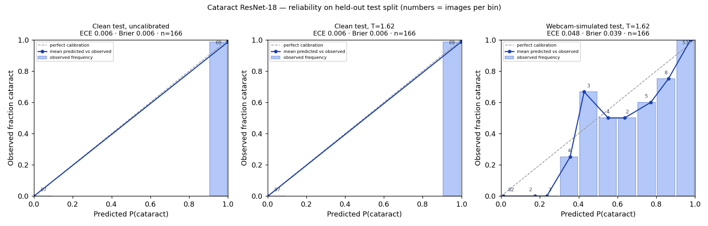
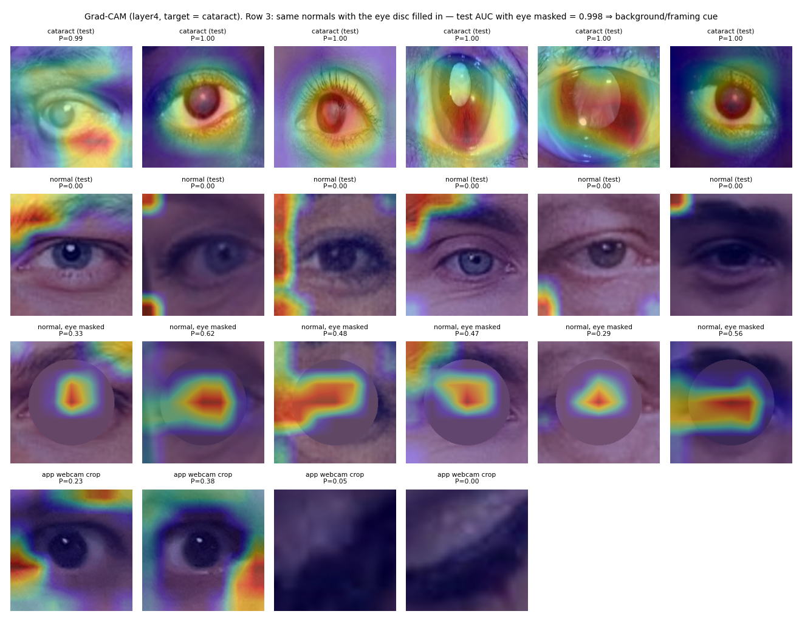

# Model card — Cataract screening ResNet-18 (`resnet_v2_calibrated`)

**One-line summary:** a binary cataract-vs-normal image classifier with temperature-scaled probabilities, a three-way screening band, an out-of-distribution abstain path and Grad-CAM. It does **not** grade severity. Held-out numbers look excellent, but that is mostly because it has learned a **dataset shortcut**: it separates the two classes nearly as well with the eye masked out. Treat every output as a prompt for an eye exam, never as reassurance.

| | |
|---|---|
| Code | `train_cataract_resnet.py`, `eyevio/app/ai_models/cataract_resnet.py`, `eyevio/app/ai_models/cnn_explain.py` |
| Artifacts | `cataract_detection_resnet18.pth`, `cataract_model_meta.json`, `cataract_ood_stats.npz` (repo root) |
| Evaluation dump | [`assets/cataract_eval.json`](assets/cataract_eval.json) |
| Owner / status | EyeVio; research screening feature, not a medical device |

## Intended use

- **Use:** a home screening prompt. Given a front-facing webcam photo, it flags whether each eye crop resembles the "cataract" class of the training images (low / indeterminate / elevated), or says **cannot assess**.
- **Out of scope:**
  - diagnosis
  - severity or LOCS III grading
  - cataract size
  - use on children
  - any decision to *not* seek care

The app never shows a 0–100 opacity score. A binary classifier's probability says nothing about how dense an opacity is: a confident mild case and an uncertain dense case can produce the same number.

## Training data

- **Source:** Zenodo [10.5281/zenodo.18250149](https://zenodo.org/records/18250149), "Ocular Image Dataset for Eye Disease Classification and Screening Research" (CC BY 4.0). It contains external (non-slit-lamp) eye photographs with **binary labels only**. The record title mentions SMOTE, so synthetic oversampling may be present.
- **Leakage control:** dHash near-duplicates (Hamming distance ≤ 6) of training images were removed from val (18 removed) and test (14). Test was also de-duplicated against val.

  | Split | Images (after de-duplication) | Cataract | Normal |
  |---|---|---|---|
  | train | 834 | 380 | 454 |
  | val | 160 | — | — |
  | test | 166 | 68 | 98 |

- **Known label noise:** some "cataract" images look normal (e.g. `train/cataract/101.jpg`).
- **Source confound:** most cataract images are clinical close-ups (dilated pupils, coloured clinical lighting, tight framing). Most normal images are face-style eye crops. See the shortcut probe below.

## Method

- **Model:** ImageNet ResNet-18 with `layer4` and `fc` fine-tuned. Augmentation uses random resized crops, blur and colour jitter to approximate webcam crops. Trained for 12 epochs with Adam (lr 1e-4); the checkpoint is chosen on **validation log-loss**, not accuracy.
- **Calibration:** temperature scaling (Guo et al., 2017), fitted on validation images plus a webcam-simulated copy of them (downscale, blur, low light, sensor noise, JPEG). The fitted value was **T = 1.62**, and it is constrained to T ≥ 1 so the fit can never sharpen probabilities.
- **Operating points:** the plan was to set "rule-out" (sensitivity ≥ 0.95) and "rule-in" (specificity ≥ 0.95) thresholds on the calibration pool. The pool is almost separable, so both fitted thresholds collapsed to 0.60. The **fixed prior thresholds 0.20 / 0.80** are used instead, and this is recorded in the metadata.
- **Out-of-distribution abstain:** class-conditional Mahalanobis distance (Lee et al., 2018) with a tied Ledoit-Wolf covariance on pooled `layer1`–`layer4` features. The score is the maximum over layers of distance ÷ that layer's validation 99th percentile. The threshold is the 99th percentile of the validation score (1.109). Above it, the API returns `cannot_assess` and no likelihood.
- **Person-level result:** the eye with the higher calibrated likelihood drives the result. If one eye abstains, the other still counts, and the result is labelled "one eye".

## Evaluation (held-out test, n = 166; bootstrap 95% CIs, 2000 resamples)

| Test set | AUC | Brier | ECE (15 bins) | Sens @0.5 | Spec @0.5 |
|---|---|---|---|---|---|
| Clean test, uncalibrated | 1.000 | 0.006 | 0.006 | 1.00 | 0.99 |
| Clean test, T = 1.62 | 1.000 (0.999–1.000) | 0.006 (0.000–0.018) | 0.006 (0.001–0.018) | 1.00 (1.00–1.00) | 0.99 (0.965–1.00) |
| Webcam-simulated test, T = 1.62 | 0.991 (0.981–0.998) | 0.039 (0.022–0.059) | 0.048 (0.039–0.085) | 0.956 (0.899–1.00) | 0.929 (0.875–0.977) |

Operating points on the webcam-simulated test set:

| Threshold | Sensitivity | Specificity | PPV | NPV |
|---|---|---|---|---|
| Rule-out 0.20 | 1.00 (1.00–1.00) | 0.857 (0.781–0.920) | 0.829 | 1.00 |
| Rule-in 0.80 | 0.868 (0.782–0.944) | 0.980 (0.948–1.00) | 0.967 | 0.914 |

Reliability diagrams for clean uncalibrated, clean calibrated and webcam-simulated test:



**There is no externally sourced test set.** Every number above is same-source, so it overstates real-world performance. The CIs capture sampling noise only, not dataset shift.

## Shortcut probe and Grad-CAM

| Probe (test set) | AUC |
|---|---|
| Full image | 1.000 |
| **Eye masked out** (central disc, radius 0.35 × image side, filled with mean colour) | **0.998** |
| Eye only (everything outside the disc filled) | 1.000 |

The classes are almost perfectly separable **without the eye**. The model can reach its score from background, skin, framing and lighting cues, a textbook shortcut (Geirhos et al., 2020). Grad-CAM (Selvaraju et al., 2017) agrees:

| Row in the grid | Share of attention on the central eye region |
|---|---|
| Cataract images | 59% |
| Normal images | 3% (attention sits on corners and borders) |
| Real app webcam crops | 4% |



## Out-of-distribution behaviour

| Probe | Share abstained |
|---|---|
| Validation (clean) | 1.25% |
| Validation, webcam-simulated | **75.6%** |
| Uniform noise / heavy blur / 12% exposure / flat colour (40 each) | 100% / 100% / 100% / 100% |
| Real app webcam pupil crops (n = 4) | 50% |
| Real app full-frame eye-pair thumbnails (n = 7) | 100% |

The full-frame thumbnails would have scored calibrated p ≈ 0.50–0.89 (five of the seven were dry-eye photos). The abstain path stopped those false "elevated" results. In realistic webcam conditions, most photos will get "cannot assess", which is the honest answer for this model.

## Failure modes

1. **Shortcut / source confound.** Webcam crops resemble the "normal" source, so a real cataract photographed on a webcam will tend to score low. **A low band is not reassurance.**
2. **Domain gap.** It was trained on external clinical photos and runs on webcam eye crops, with different optics, resolution, lighting and framing. The webcam simulation only models part of this gap (it does not model framing).
3. **No severity.** Binary labels cannot give a grade. The CORN ordinal pipeline (`train_cataract_corn.py`) is ready for graded normal / immature / mature data. LOCS III (Chylack et al., 1993) needs slit-lamp images and cannot come from a selfie.
4. **Label noise and possible synthetic samples** in the source data.
5. **Small real-world probe set** (4 app crops), so the abstain rate on real users is not yet well estimated.

## Deployment

The browser and the server run the same decision logic. `scripts/export_onnx.py` exports one graph that returns the calibrated probability, logits, the Mahalanobis out-of-distribution score and the class-activation map. It checks that graph against the production PyTorch path on the held-out test set ([`assets/onnx_export_report.json`](assets/onnx_export_report.json)):

| Variant | Test set | AUC | Largest probability change | "Cannot assess" agreement | Band agreement (both assessed) |
|---|---|---|---|---|---|
| ONNX fp32 (browser default, 46 MB) | clean | 1.000 | 5 × 10⁻⁷ | 100% | 100% |
| ONNX fp32 | webcam-simulated | 0.986 | 1 × 10⁻⁶ | 100% | 100% |
| ONNX int8 (12 MB) | clean | 1.000 | 0.049 | 100% | 100% |
| ONNX int8 | webcam-simulated | 0.986 | 0.168 | 97.0% | 95.2% |

- **int8 is not used.** On webcam-like crops it changes the abstain decision for 3% of images and the band for 5% of assessed ones, and its class-activation map no longer matches fp32. It saves 34 MB of download but only 1.3× in runtime over ONNX fp32. On the server it is no faster than PyTorch (10.7 ms against 11.3 ms per image), so the server keeps PyTorch. Four quantisation recipes are compared in [`assets/onnx_quant_experiments.json`](assets/onnx_quant_experiments.json).
- **On-device by default.** The browser runs the fp32 export in a Web Worker and sends only the calibrated probability (the temperature is part of the graph), the out-of-distribution score and the crop-quality numbers. The server checks the model's SHA-256 against the manifest and applies the band thresholds and the abstain rule itself, so the band and "cannot assess" decision always come from server code.
- The browser crop and resize are checked against the server by `eyevio-frontend/scripts/run-ondevice-parity-tests.mjs`.

## What would make this trustworthy

- Clinician-graded, same-device (webcam or phone) photos from the same people for both classes. That removes the source confound.
- Patient-level splits.
- An external test site.
- Re-running `train_cataract_resnet.py`. It reports the eye-masked AUC automatically; that number should fall towards 0.5.

## Reproduce

```bash
./eyevio/venv/bin/python train_cataract_resnet.py --epochs 12   # ~2.5 min on Apple MPS
./eyevio/venv/bin/python -m pytest eyevio/tests/test_cataract_screening.py
```

## References

- Guo C, Pleiss G, Sun Y, Weinberger KQ. On calibration of modern neural networks. ICML 2017.
- Lee K, Lee K, Lee H, Shin J. A simple unified framework for detecting out-of-distribution samples and adversarial attacks. NeurIPS 2018.
- Selvaraju RR et al. Grad-CAM: visual explanations from deep networks via gradient-based localization. ICCV 2017.
- Geirhos R et al. Shortcut learning in deep neural networks. Nature Machine Intelligence 2020.
- Shi X, Cao W, Raschka S. Deep neural networks for rank-consistent ordinal regression based on conditional probabilities. Pattern Analysis and Applications 2023.
- Chylack LT Jr et al. The Lens Opacities Classification System III. Arch Ophthalmol 1993.
- Mitchell M et al. Model cards for model reporting. FAT* 2019.
