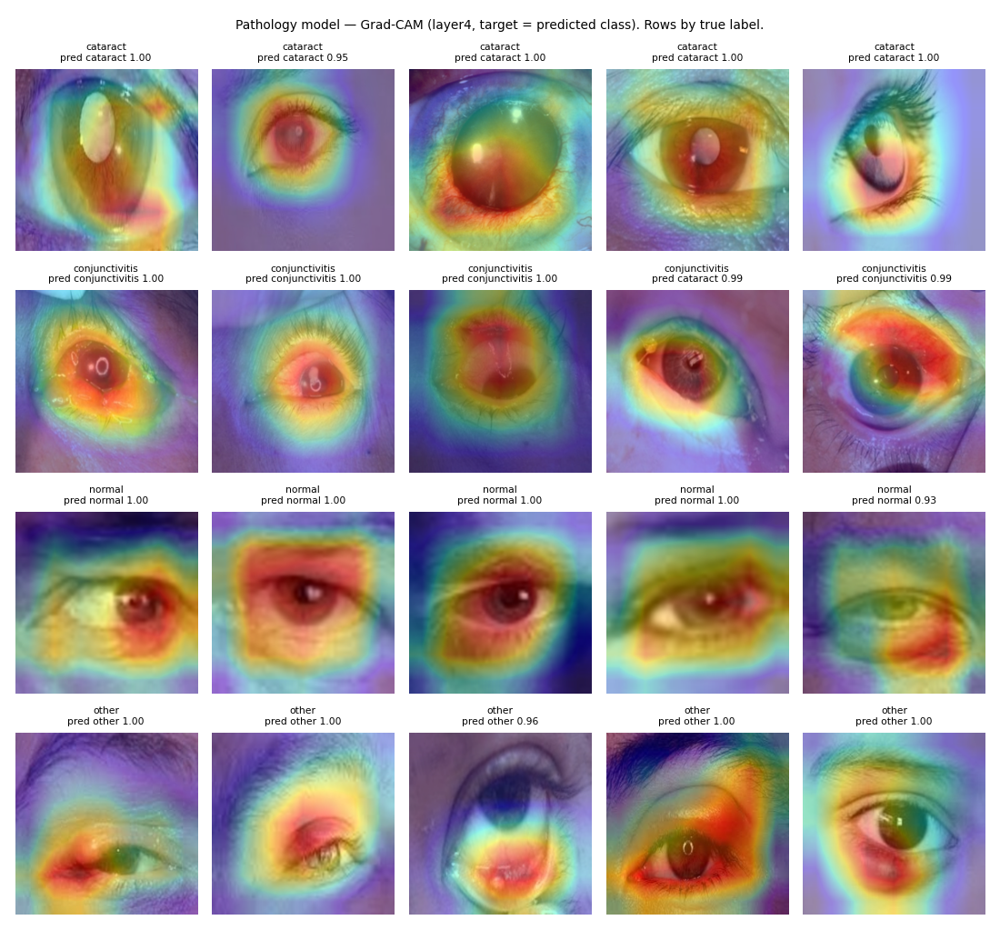

# Model card — Ocular pathology triage ResNet-18 (`pathology_resnet18_v1`)

**One-line summary:** a four-class softmax classifier (cataract / conjunctivitis / normal / other), now **research lab only**: its class and probabilities are withheld from users and the former research-triage panel was removed. It is the most eye-focused of the three models, but it still scores far above chance with the eye masked, and 15% of its test set duplicates training images.

| | |
|---|---|
| Code | `train_pathology_classifier.py`, `eyevio/app/ai_models/pathology_classifier.py` |
| Artifacts | `pathology_resnet18.pth`, `pathology_class_names.json` |
| Evaluation dump | [`assets/pathology_eval.json`](assets/pathology_eval.json) (`scripts/eval_model_cards.py`) |

## Intended use

- **Status:** research lab only (`/research-lab`). Where it runs, the app shows only the three experimental messages (`withhold_model_outputs()`).
- **Original design (not deployed):** a research panel ("closer to cataract / conjunctivitis / normal / other examples") on cataract and eye-photo results.
- **Out of scope:** any user-facing result, diagnosis, triage decisions, alerts, or anything that changes what a user does about care.

## Training data

- **Source:** Zenodo 10.5281/zenodo.18250149.

  | Split | Normal | Conjunctivitis | Cataract | Other |
  |---|---|---|---|---|
  | train | 454 | 249 | 380 | 523 |
  | val | 97 | 53 | 81 | 112 |
  | test | 98 | 55 | 82 | 113 |

- The cataract and normal folders are the same images as the cataract model's.
- **The splits were not de-duplicated:** 51 of 348 test images (15%) are dHash near-duplicates (distance ≤ 6) of training images, which inflates the test metrics.

## Evaluation (held-out test, n = 348; bootstrap 95% CIs)

| Metric | Value |
|---|---|
| Accuracy | 0.977 (0.960–0.991) |
| Macro-F1 | 0.975 (0.956–0.991) |
| Top-label ECE (uncalibrated softmax) | 0.015 |
| Multiclass Brier | 0.038 |

| Recall per class | Cataract | Conjunctivitis | Normal | Other |
|---|---|---|---|---|
| | 1.00 | 0.93 | 1.00 | 0.96 |

**Shortcut probe:** with the eye masked, accuracy is 0.687 and macro-F1 is 0.683, against a chance macro-F1 of 0.25. Much of the signal is in the eye, but a large share is not.

**Grad-CAM:** 56–66% of attention falls on the central eye region across classes, which is better than the cataract and redness models.

## Failure modes

1. Duplicate leakage inflates the test metrics; re-split with the de-duplication logic in `train_cataract_resnet.py`.
2. The same source confound as the cataract model for the cataract and normal classes.
3. No temperature scaling and no out-of-distribution abstain path. Softmax confidence on webcam crops is not meaningful.
4. "Other" is a heterogeneous catch-all class.
