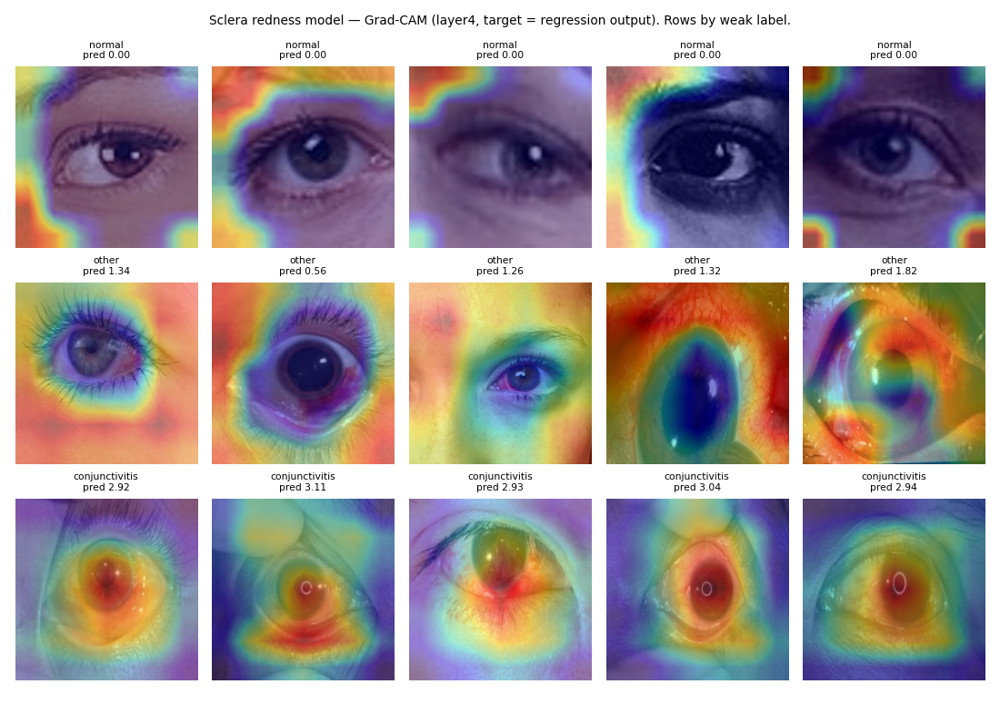

# Model card — Sclera redness ResNet-18 (`bounded_ordinal_resnet18_v1`)

**One-line summary:** a ResNet-18 regression head clamped to 0–4, run as a single pass (the 5-pass test-time augmentation variant, `bounded_ordinal_resnet18_tta_v1`, is opt-in). Despite the "ordinal" name it is **not** an ordinal (CORAL/CORN) model, and it has **never seen a graded redness label**. Every training label is a diagnosis folder mapped to a number, so the output behaves like a three-class classifier (normal / other / conjunctivitis) on an arbitrary numeric scale.

| | |
|---|---|
| Code | `train_bounded_ordinal.py`, `scripts/build_sclera_train_split.py`, `eyevio/app/ai_models/sclera_redness_model.py` |
| Artifacts | `sclera_redness_ordinal.pth` (legacy fallback: `best_unfrozen_ordinal.pth`); browser export `onnx_models/sclera_redness.int8.onnx` |
| Evaluation dump | [`assets/redness_eval.json`](assets/redness_eval.json) (`scripts/eval_model_cards.py`) |

## Intended use

- **Use:** a wellness trend signal for visible eye redness in dry-eye photo tracking, alongside the CV redness metrics.
- **Out of scope:** diagnosing conjunctivitis or any other condition; clinical redness grading on scales such as Efron or CCLRU.

## Training data

- **Source:** the same Zenodo record as the cataract model (10.5281/zenodo.18250149), folders `normal` / `other` / `conjunctivitis`.
- **Labels are weak:** normal → 0, other → 1, conjunctivitis → 3 (`WEAK_GRADE` in `build_sclera_train_split.py`). No image has a human redness grade. Grades 2 and 4 never occur in training.

  | Split | Normal (0) | Other (1) | Conjunctivitis (3) |
  |---|---|---|---|
  | train | 454 | 156 | 249 |
  | val | 97 | 33 | 53 |
  | test | 98 | 34 | 55 |

- The 454 / 97 / 98 "normal" images are the same normal images used by the cataract model, so the same face-crop-versus-clinical-close-up source confound applies.

## Evaluation (held-out test, n = 187; bootstrap 95% CIs)

These metrics use the 5-pass TTA mean, clamped to 0–4. Production now runs a single pass, which scores MAE 0.134 and Spearman 0.979 on the same images with identical grades (see Deployment).

| Metric | Value |
|---|---|
| MAE vs weak grade | 0.131 (0.093–0.171) |
| Spearman ρ | 0.979 (0.966–0.986) |
| AUC, conjunctivitis vs normal | 1.000 (1.000–1.000) |
| Nearest-weak-class accuracy | 0.968 (0.941–0.989) |

Mean prediction by weak label:

| Weak label | n | Mean prediction ± SD |
|---|---|---|
| normal | 98 | 0.00 ± 0.00 |
| other | 34 | 1.30 ± 0.42 |
| conjunctivitis | 55 | 2.88 ± 0.36 |

- **Leakage:** 8 of 187 test images are dHash near-duplicates of training images.
- **Calibration:** not applicable in the usual sense, since the output is a regression score and there is no graded ground truth to calibrate against.

## Shortcut probe and Grad-CAM

- With the central eye disc masked out, conjunctivitis vs normal AUC is still **0.993**. The separation does not depend on the sclera.
- Every normal test image scores exactly 0.00 because of the clamp. On normal images, Grad-CAM attends to image corners and borders (1% of attention on the central eye region); for conjunctivitis it is 60%.

## Failure modes

1. The numeric scale is invented (0 / 1 / 3 spacing). Differences such as "1.3 vs 1.8" carry no validated meaning.
2. **Source confound:** the "normal = 0" behaviour is partly learned from background and framing, so webcam photos (which resemble the normal source) will score low regardless of redness.
3. No out-of-distribution abstain path yet (unlike the cataract model).
4. TTA spread (`uncertainty_std`, only reported with `SCLERA_TTA=1`) is not calibrated uncertainty.

## Deployment

Figures from `scripts/export_onnx.py` ([`assets/onnx_export_report.json`](assets/onnx_export_report.json)) on the same 187 test images; latency is one image on an Apple Silicon CPU.

| Variant | MAE | Spearman | Grades vs TTA | Largest score change vs PyTorch single pass | Latency |
|---|---|---|---|---|---|
| PyTorch, 5-pass TTA | 0.131 | 0.979 | — | — | 56 ms |
| PyTorch, single pass (server default) | 0.134 | 0.979 | 100% | — | 11 ms |
| ONNX fp32 | 0.134 | 0.979 | 100% | 2 × 10⁻⁶ | 14 ms |
| ONNX int8 (browser default, 11 MB) | 0.138 | 0.976 | 100% | 0.32 (mean 0.015) | 10 ms |

- **TTA was dropped from the default.** The single-pass minus TTA MAE difference has a 95% CI of −0.001 to 0.007, which includes zero, for 5× the compute. `SCLERA_TTA=1` restores it.
- **On-device by default.** The browser runs the int8 export in a Web Worker with ONNX Runtime Web and sends only the score. The server checks the model's SHA-256 against `onnx_models/manifest.json` and derives the grade itself.
- **int8 is not used on the server**, where PyTorch is already as fast.
- The browser preprocessing is checked number by number against the server pipeline by `eyevio-frontend/scripts/run-ondevice-parity-tests.mjs`.

## Recommended next steps

- Grade a few hundred same-device photos on a published redness scale (e.g. Efron 0–4) with two graders.
- Retrain with a CORN head (`eyevio/app/ai_models/corn.py`).
- Add the Mahalanobis abstain from `cnn_explain.py`.
